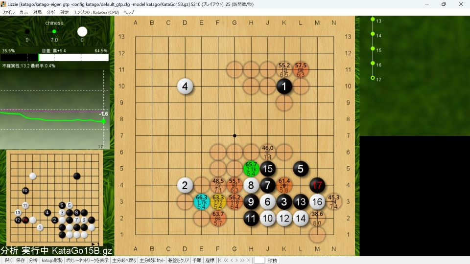
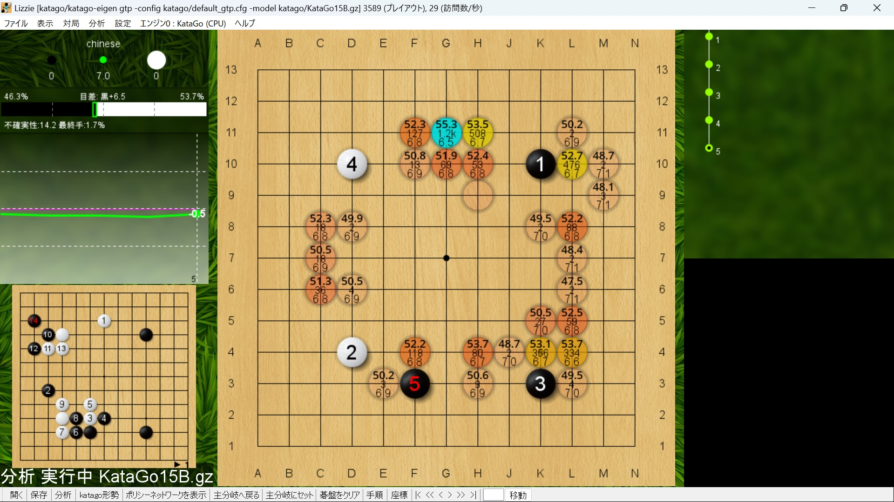

# 黒番二連星

## 二連星ｖｓ星・小目

### ナダレ型

黒番二連星で出現率高めのナダレ型。

小ナダレ定石は覚えておいて損はない。

白１６のツケは知らないと打てないと思う。

黒１と打てば穏やか。

### 星にツケ

星にツケるのは有力。ソフト評価値はこちらの方が高い。

黒９と小目にカカる手を見ている。

白は打ち込む気がないのならば白８とサガる。これにも黒９のカカり。

白６と外からオサえる手もある。８手目は選択肢が３つある。

実戦的には三々入り定石風になることが多いだろう。

## 二連星ｖｓ向かい小目

黒の模様ｖｓ白の実利という展開になりやすい。

小目にツケる手は有力。黒は外勢を得やすく、模様派におすすめ。

小目にカカるとハサまれる。黒が悪いわけではないが、白がペースをつかみやすいと思う。

## 二連星ｖｓ二連星

13路盤では星はさほど人気がなく、出現率は低め。

黒５のツケから黒９とカカるのが一例。左上の白も強い石ではない。

黒５のカカりも当然有力。ただ６手目の選択肢は多く事前研究は難しい。

# 白番二連星

## 星・小目ｖｓ二連星

黒のシマりには白６とツケるのが有力だが、その後の展開は難しい。

黒７と受けてくれるのならば白６はキカしと見て、軽く捨てるのが良いだろう。

黒７とハネて来ると難解。まずは白８とハネ返す。

黒９と切れば黒１７までは一本道。右下の白は簡単には死なない。

黒から無理に取りに行っても得にはならない。白の外勢が勝る。

黒９とシマれば穏やか。

## 小林流ｖｓ二連星

黒がシマりを省略する打ち方。小目にカカってくればハサんで攻めようという作戦。

白６は穏やかに見えるが、黒７と両ガカりされると忙しい局面。

白６と受ければ穏やか。黒７と三々に入られるが、これからの碁だろう。

# 星・小目ｖｓ星・小目

５手目から候補が８種類ぐらいある。定石はない。

小目にカカる手が自然ではある。

ソフト的には黒５とツケる手も有力。

星にカカれば穏やか。囲い合いの碁になりやすい。

