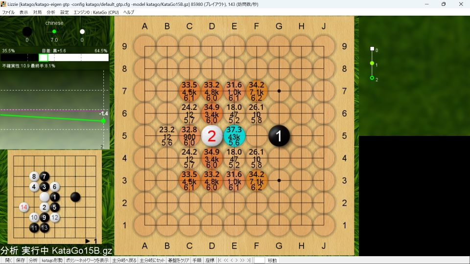
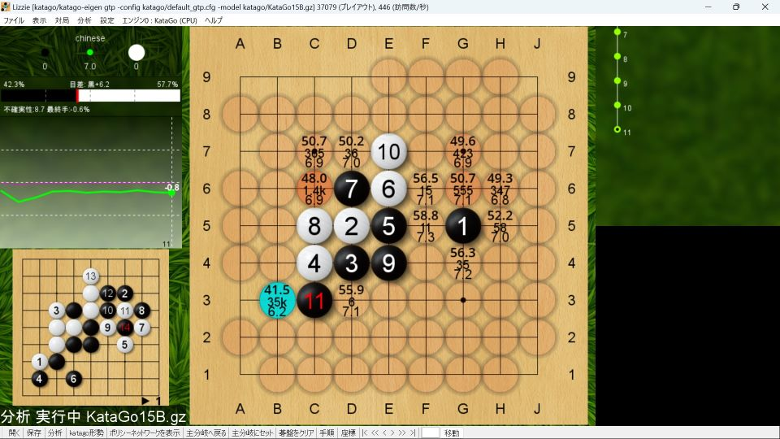

９路盤といえども、最善手から0.5目差以下の手は多く、網羅的に事前研究を行うことは不可能である。
特に初段（囲碁クエストのレート1700）程度だと、定石通りになる確率は低く、勝率への貢献度は低い。
この程度の事前研究があれば、最序盤で知識面で不利になることはないという心理的な意味合いが強い。

シミュレーション回数に依存する議論だが（究極的には全て盤面で+7.0であることを予想しているが）、
初手のソフト評価値（目差）は、盤面で高目+7.0、天元+6.7、星+6.4、目外し+6.2、小目+6.0、三々+5.7程度である（中国ルール）。
初手高目は白番が戦形の選択権を持つため、黒番が覚えるべきことが多い。
そのため、著者は黒番は初手天元が多く、天元の定石を詳しめに記載している。
天元以外は白番目線である。

# 天元の定石

黒の攻め、白のシノギとなり、アマチュア的には黒が打ちやすい。
初手のソフト評価値は高目に0.3目ほど劣るものの、黒番が戦形の選択権を持つため主導権を握りやすく、マネ碁対策をしなくてもよいというメリットがある。

## リフティング定石

黒３とするのがリフティング定石。

白４には黒５として囲い合う形になれば、黒が少し良い。

### リフティング定石（旧型）

有名定石。
続いてＦ４とコスむのが定石とされる。

囲い合いになれば白が勝てないので、白１０（Ｆ８）とツケて様子を見る。
Ｆ３やＢ５は重要な争点だが、上辺の受け方を見てから打つところ。

Ｃ７の三々を牽制する意味で黒１１（Ｅ８）と左から抑えるのが定石。
ここからは変化が多く、実戦では知らない形になることが多い。

### リフティング定石（新型）

白が小目に入って２か所で生きようとする作戦。
ソフト評価値は高いが難解。

黒５（Ｄ４）のコスミが定石とされるが、その後の変化は多く難解。

（ソフト評価値も良いが）実戦的にも白６となりやすい。

### リフティング定石（三々）

三々に入るのも有力。黒に事前準備がないことも多い。

黒５（Ｆ３）にツケて右辺を固めて囲い合えば持碁になりやすい。

### リフティング定石（扇子）

白４（Ｅ７）にツケるのが扇子。

ソフト推奨は黒５（Ｃ５）のトビだが、白６（Ｆ６）とハネ出されると難解。

自然な手は黒５（Ｆ６）。白の応手は多く、定石化されていないが、白Ｇ４には黒Ｂ６。

## 振り子定石

黒３とするのが振り子定石。
４手目から変化が多い。

### 振り子定石（一間トビ）

実戦的には白４となることが多いが、その後も変化が多く、覚えきれるものではない。

白は左上に打ち込んでも部分的には生きがないが、様々な利きが生じるので、黒地を減らしていくことができる。

左上の打ち込みを牽制して１路左に寄せることも考えられるが、白６と打たれると、左上と右上が見合い。

黒５と打っても白が少しだけ打ちやすいようである。

### 振り子定石（ケイマ）

白４には黒５と押すのが自然な一手だが難解。

白８に対して、黒がＧ６に押さえる。双方最善を尽くせば持碁になるらしい。

黒５とケイマに外す手も有力であるが、その後も変化が多く難しい。

### 振り子定石（ハイ）

白４のハイに対しては黒５の封鎖。

白６に対して、Ｆ７（天元からのケイマ）が自然な一手で簡明。
Ｅ７（一間トビ）は右上に打ち込まれて難しい戦いになる。

白６のハサミツケに対して、黒はＣ６とツケ返す手を覚えておくとよい。
天元からのケイマは良い手になりやすい。

## 風車定石

石が切り合っているので一手間違えるとツブれてしまう定石。

黒１は敗着。白は３子を捨てれば勝勢。

黒３とノビるのもダメ。後からＧ４と打っても利かない。

# 星の定石

黒の攻め、白のシノギの展開になりやすい。
黒番はマネ碁対策が必要だが、ブラックブーメラン定石の黒３の展開になれば不要。

## ブラックブーメラン定石

黒５とするのがブラックブーメラン定石。

黒７まで豆まき型。９手目からは変化多い。

白６とアテる手も一般的だが、持碁になりやすい。

格上相手に持碁を狙うならば白８とツぐのが簡明で有力。

## 忍者定石

ソフト評価値的には黒がやや不利であるが、シノギを得意とする打ち手に好まれる。

黒５と二か所で生きる狙い。コミの負担は小さくないので、ソフト評価値的には黒がやや不利ではある。

白番は白６を覚えておくとよい。黒は上下を見合いにしてシノギには困らない。

# 高目の定石

黒の攻め、白のシノギの展開になりやすい。
黒番から見てソフト評価値は高いが、白番が戦形の選択権を持つため、黒番が覚えるべきことが多い。
高段者には人気だが、初段程度だと打ちこなすことが難しい。

白からの選択肢が多いため、黒からは事前研究が難しい。

一例としては白４と低く構えて、白８と荒らすなどの展開が想定。左上の白石の死活が焦点になりやすい。

白からはこういう打ち方もある。白４はスライダーと呼ばれる。

アンドロメダ定石として有名。黒から事前研究しやすい形。

黒３は良い手ではないが、白４は覚えておいた方が良いだろう。

# 小目対策

初手小目のソフト評価値は低い（白良し）。シノギを得意とする打ち手に好まれる。

白は反対側の星に打つのが良い。

実戦では黒５（Ｅ２）に打ち込まれることも多い。

白６に対して黒が左上を受けると、黒５（Ｅ２）は部分的には生きがない。

# 三々対策

初手三々は悪手とされる。

白２と肩をつくのが良い。

三々を捨ててくる手には白は素直に取っていて良い。

# 目外し対策

難しい変化になりやすい。ただ白からの選択権が多く、黒の事前研究も容易ではない。

白は反対側の高目に打つと激しい展開になりやすい。

進行の一例。比較的穏やかな展開。

ソフト評価値的には白が良いが、これは難しい戦い。

白が星に打つと穏やかな展開。白が５の２に入ってどうなるかの勝負。

