# 天元の定石

## リフティング定石

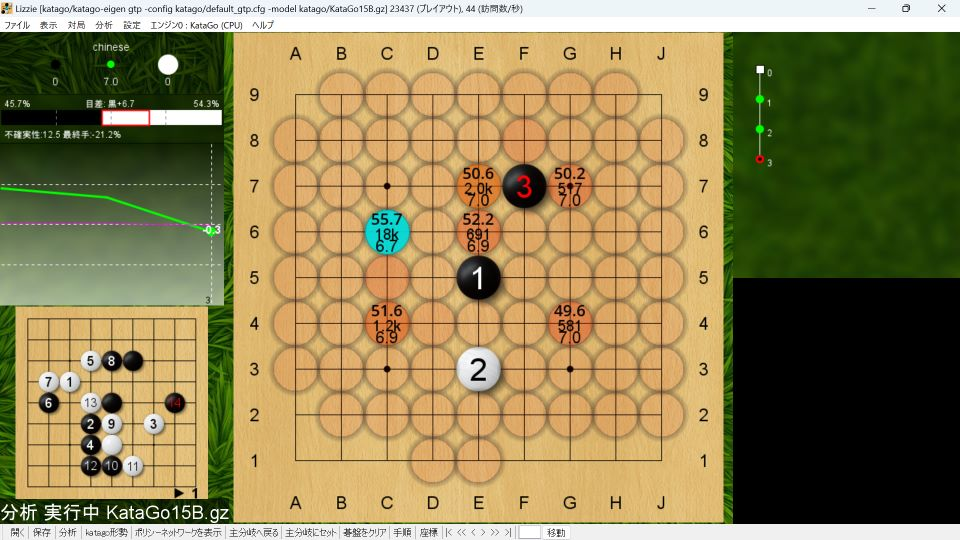

黒３とするのがリフティング定石。

白４には黒５として囲い合う形になれば、黒が少し良い。

### リフティング定石（旧型）

有名定石。
続いてＦ４とコスむのが定石とされる。

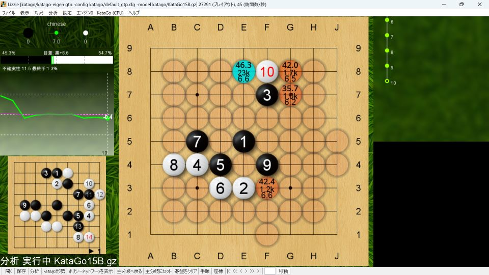

囲い合いになれば白負けなので、白１０（Ｆ８）とツケて様子を見る。
Ｆ３やＢ５は重要な争点だが、上辺の受け方を見てから打つところ。

Ｃ７の三々を牽制する意味で黒１１（Ｅ８）と左から抑えるのが定石。
ここからは変化が多く、実戦では知らない形になることが多い。

### リフティング定石（新型）

白が小目に入って２か所で生きようとする作戦。
ソフト評価値は高いが難解。

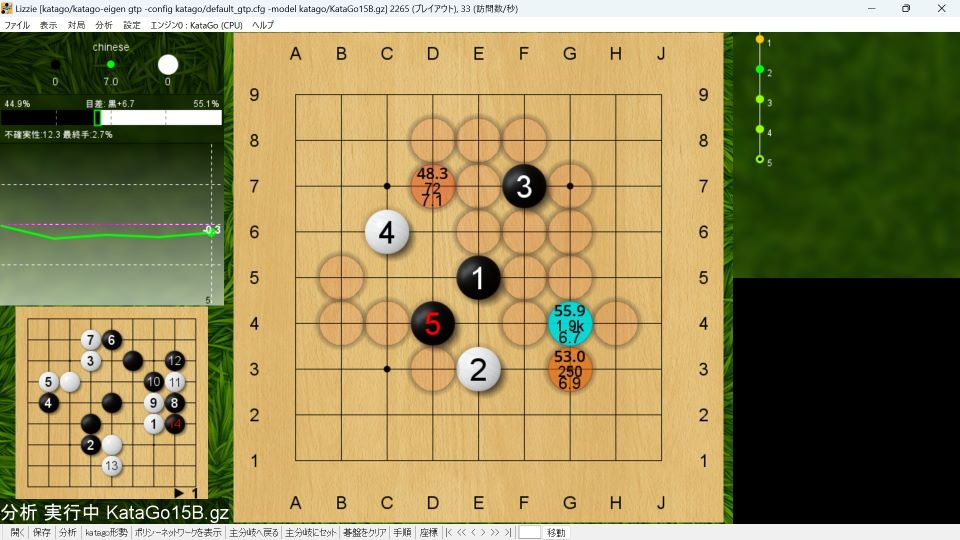

黒５（Ｄ４）のコスミが定石とされるが、その後の変化は多く難解。

（ソフト評価値も良いが）実戦的にも白６となりやすい。

### リフティング定石（三々）

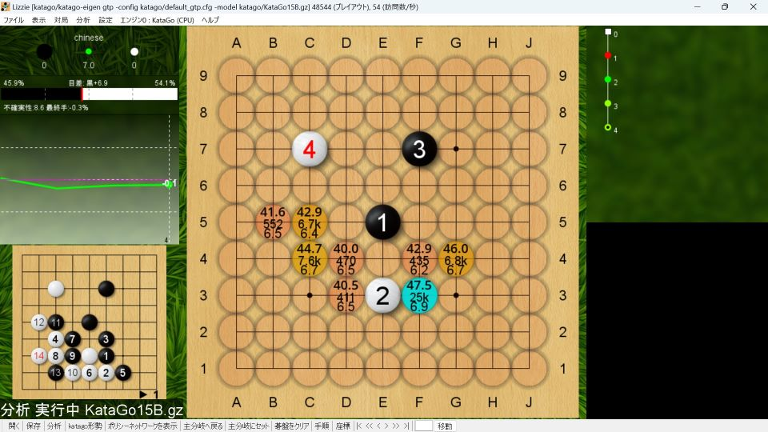

三々に入るのも有力。黒に事前準備がないことも多い。

黒５（Ｆ３）にツケて右辺を固めて囲い合えば持碁になりやすい。

## 振り子定石

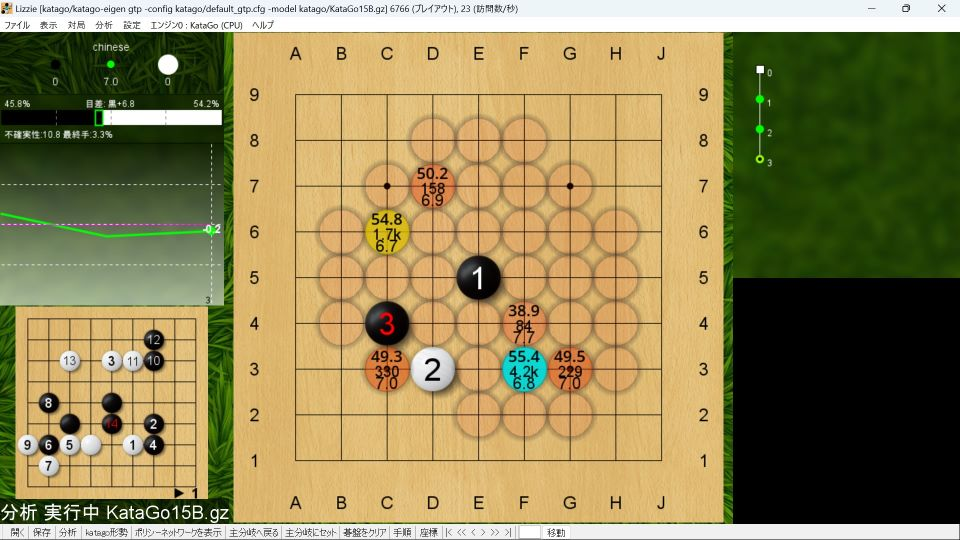

黒３とするのが振り子定石。
４手目から変化が多い。

実戦的には白４となることが多いが、その後も変化が多く、覚えきれるものではない。

白は左上に打ち込んでも部分的には生きがないが、様々な利きが生じるので、黒地を減らしていくことができる。

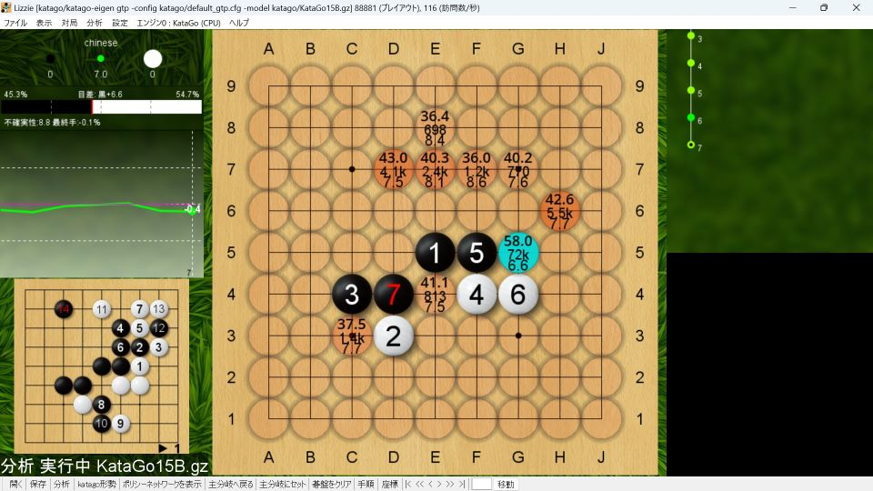

白４には黒５と押すのが自然な一手だが難解。

白８に対して、黒がＧ６に押さえる。双方最善を尽くせば持碁になるらしい。

黒５とケイマに外す手も有力であるが、その後も変化が多く難しい。

## 風車定石

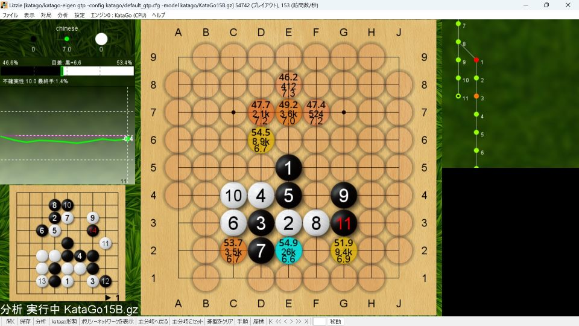

石が切り合っているので一手間違えるとツブれてしまう定石。

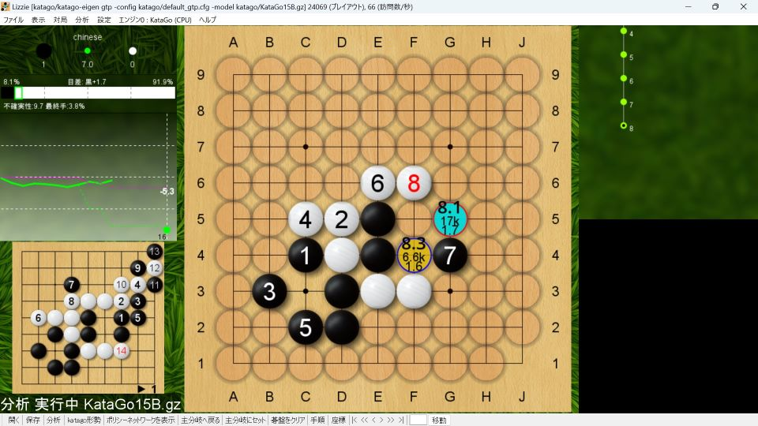

黒１は敗着。白は３子を捨てれば勝勢。

黒３とノビるのもダメ。後からＧ４と打っても利かない。

# 星の定石

## ブラックブーメラン定石

黒５とするのがブラックブーメラン定石。

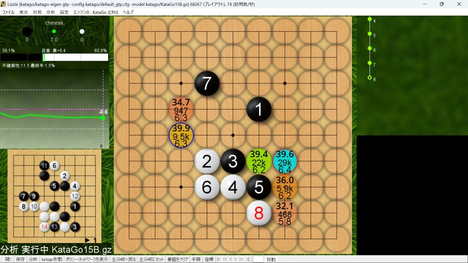

黒７まで豆まき型。９手目からは変化多い。

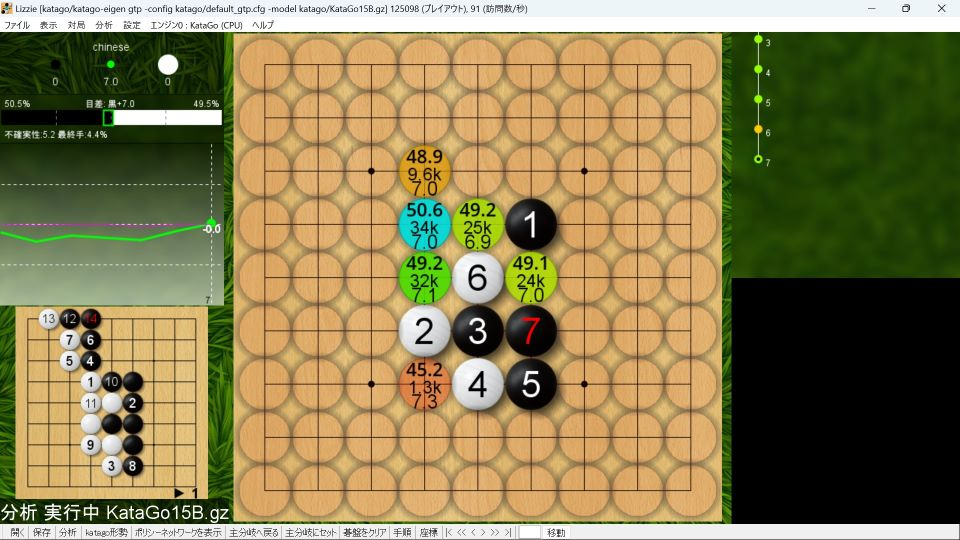

白６とアテる手も一般的だが、持碁になりやすい。

# 高目の定石

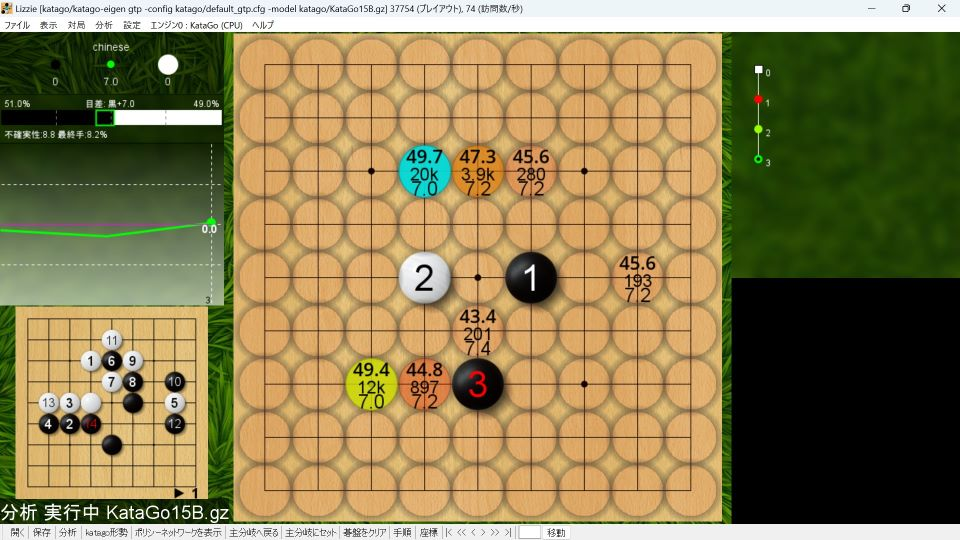

白からの選択肢が多いため、黒からは事前研究が難しい。ソフト評価値は高い。

一例としては白４と低く構えて、白８と荒らすなどの展開が想定。左上の白石の死活が焦点になりやすい。

白からはこういう打ち方もある。白４はスライダーと呼ばれる。

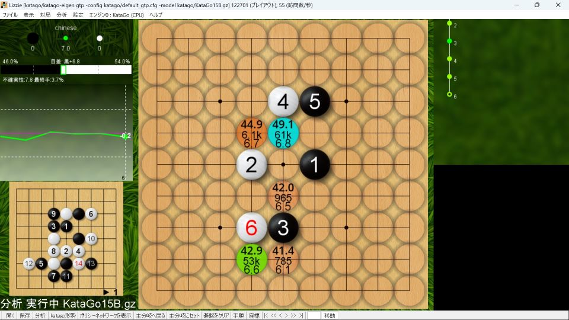

アンドロメダ定石として有名。黒から事前研究しやすい形。

# 小目対策

初手小目のソフト評価値は低い（白良し）。白は反対側の星に打つのが良い。

実戦では黒５（Ｅ２）に打ち込まれることも多い。

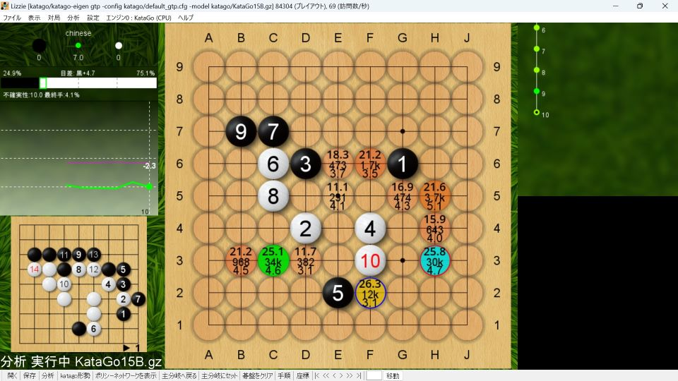

白６に対して黒が左上を受けると、黒５（Ｅ２）は部分的には生きがない。

# 三々対策

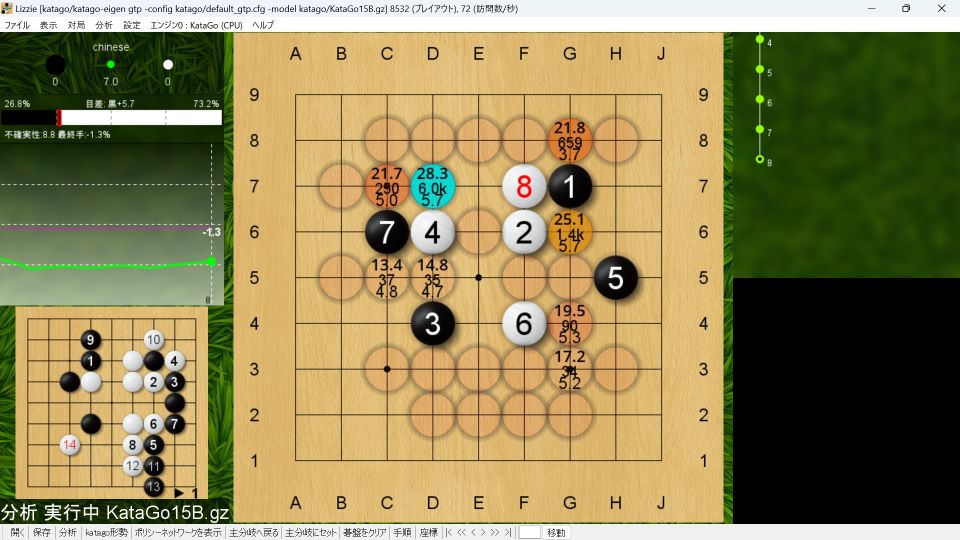

初手三々は悪手とされる。

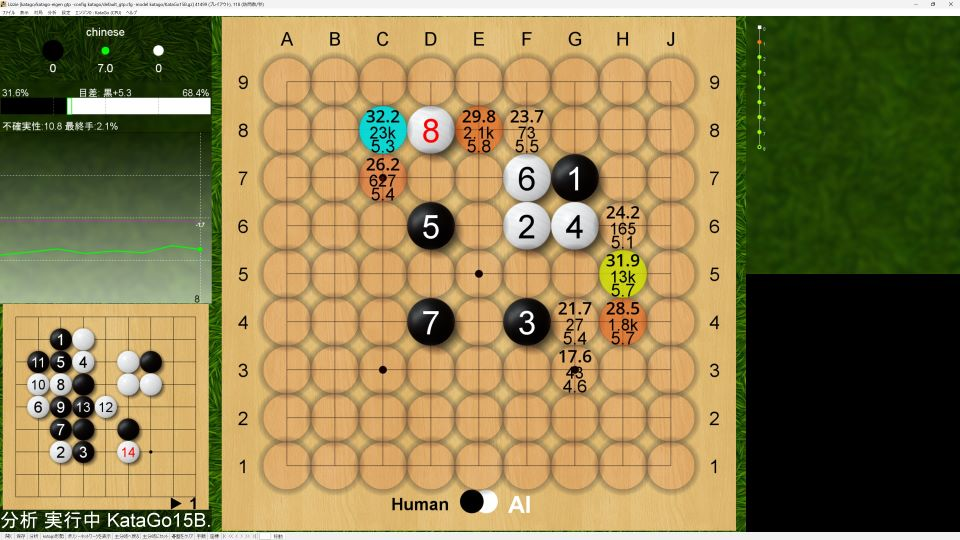

三々を捨ててくる手には白は素直に取っていて良い。

